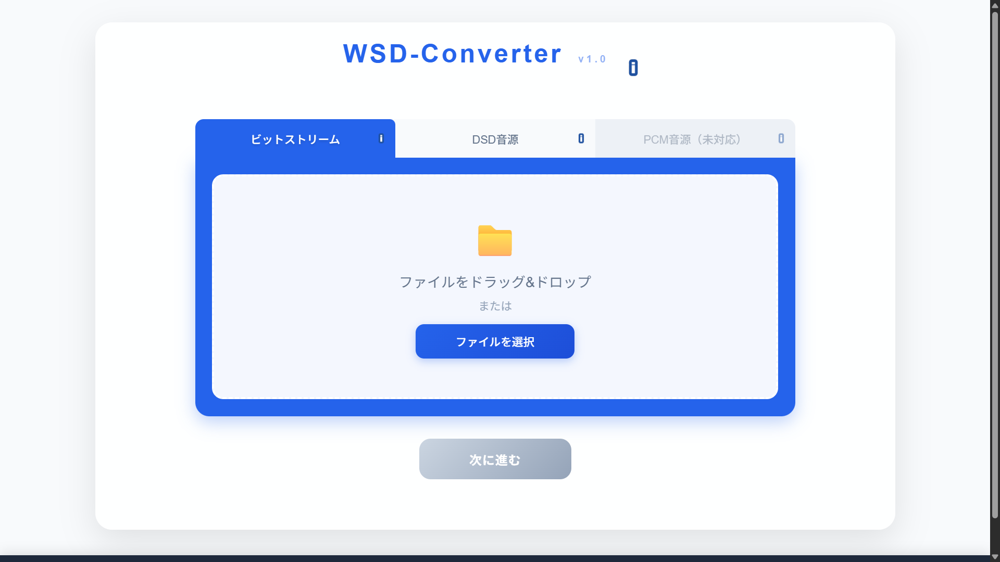
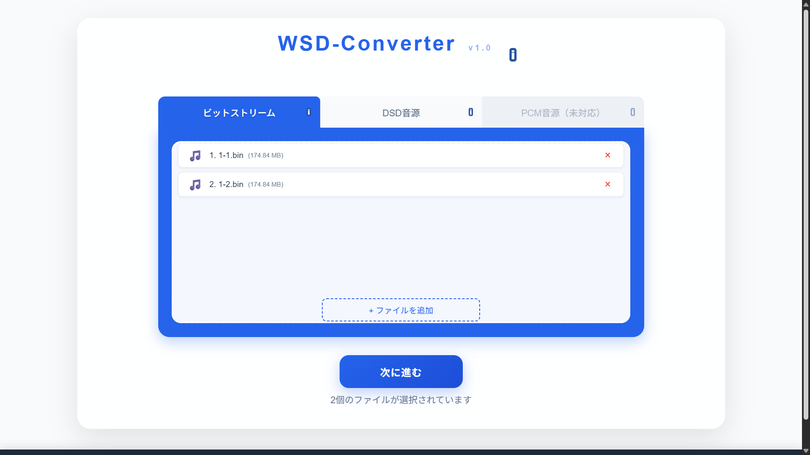
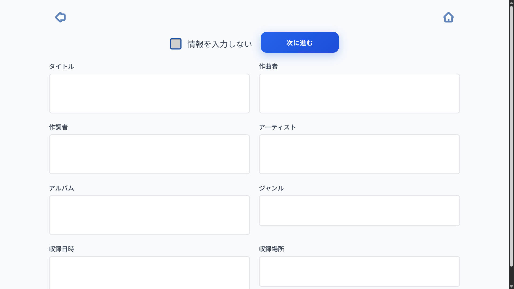
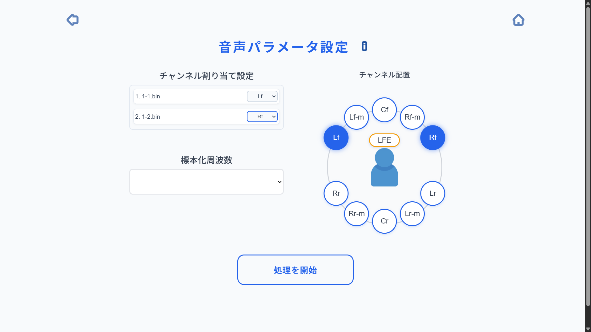

# WSD-converter

## 概要
バイナリファイルやDSDファイルおよびPCMファイルをWSDファイルに変換するツールです。
WASMを採用した構成によりサーバーにファイルをアップロードせずにお使いいただけます。

## デモ
https://acoustoikawalab.github.io/WSD-converter/

## 機能

### ビットストリーム変換
1ビットオーディオのRAWデータが入ったファイルをご用意ください。1chごとのバイナリファイルを結合して変換します。

### DSDファイル変換
ヘッダーの付け替えを行います。特にパラメータ等の指定は必要ありません。

## 使い方

### ビットストリームの変換手順
1ビットオーディオのRAWバイナリデータを入力に利用します。
入力にはチャンネルごとに独立したバイナリファイルが必要です。
データ配列に関する仕様の詳細は[仕様書の11ページ](./wsd_file_format_ver1_1.pdf#page=11)をご参照ください。

**メタデータ入力**
仕様書に基づきタイトルからUser Specificデータまでの10項目を入力できます。すべて空欄でも構いません。入
テキスト入力制限の詳細は[仕様書の9〜10ページ](./wsd_file_format_ver1_1.pdf#page=9)をご参照ください。

**音声パラメータ入力**
チャンネル割り当ておよび標本化周波数の設定を行ってください。
標本化周波数は1.4MHzから12.2MHzまでの主要なプリセットから選択できるほか、任意の数値を手入力で指定することも可能です。
チャンネルごとのスピーカー配置フラグの規定については[仕様書の8~9ページ](./wsd_file_format_ver1_1.pdf#page=8)に基づいています。

### DSDファイルの変換手順
拡張子がdsfまたはdsdiffのファイルを入力してください。元のメタデータを維持したままwsdに変換されます。特別設定する事項はありません。

## 技術仕様
- 出力フォーマット: WSD Version 1.1
- 標本化周波数: 制限なし
- 対応チャンネル数: 1chから6chまで対応

## 開発状況
リニアPCMの変換機能は現在開発中です。デルタシグマ変調を含む処理に対応予定です。

## 技術スタック
- WebAssembly 
- JavaScript 
- HTML / CSS
- Rust

## ライセンス
本プロジェクトのソースコードはMIT Licenseのもとで公開されています。詳細はLICENSEファイルをご確認ください。

**仕様書に関する権利表記**
本ツールは「WSDファイル仕様 Version 1.1」に基づいて開発されています。
本仕様の著作権は1ビットオーディオコンソーシアムに帰属します。
1ビットオーディオコンソーシアムは、本仕様の使用により生じるいかなる損害について、一切の責任を負わないものとします。
